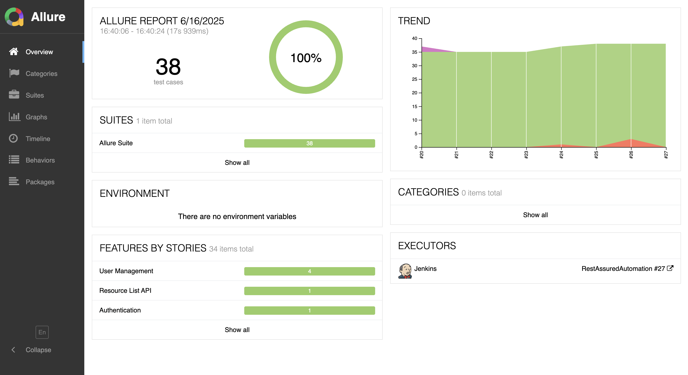

# 🚀 REST Assured Automation Framework

<div align="center">


</div>

## 📋 Overview

A robust and scalable API testing framework built with REST Assured, TestNG, and Allure Reports. This framework provides comprehensive test coverage for the ReqRes.in API, featuring modern testing practices and continuous integration capabilities.

## 🚀 Features

- REST Assured for API testing
- TestNG for test execution and assertions
- Allure for beautiful test reporting
- JSON Schema validation
- Request/Response logging
- Custom assertions
- POJO-based request/response handling
- Environment configuration
- Jenkins CI/CD integration

## 📋 Test Suite Organization

### Test Packages
1. `com.reqres.test` - Main API Tests
   - User Management
     - Create User
     - Get User
     - Update User
     - Delete User
   - Authentication
     - Login
   - Resource Management
     - Get Resource List
     - Get User List

2. `com.rest` - Example and Utility Tests
   - Request/Response Specifications
   - JSON Schema Validation
   - Request Parameters
   - Filters and Logging
   - Static Imports
   - BDD Style Tests

### Test Categories
- CRUD Operations
- Authentication
- Data Validation
- Schema Validation
- Response Time
- Error Handling

## 🛠️ Prerequisites

- Java JDK 11 or higher
- Maven 3.6.x or higher
- Jenkins (for CI/CD)
- Allure Commandline Tool

## 🚀 Getting Started

### 1. Clone the Repository
```bash
git clone https://github.com/abhi9avx/CoreRestAssured.git
cd CoreRestAssured
```

### 2. Install Dependencies
```bash
mvn clean install
```

### 3. Run Tests
```bash
# Run all tests with default configuration
mvn clean test -P run-all-tests

# Run with custom configuration
mvn clean test -DBASE_URL=https://reqres.in -Dsurefire.suiteXmlFiles=src/test/resources/testng.xml

# Run specific test class
mvn test -Dtest=JsonSchemaValidation

# Generate and view Allure report
mvn allure:serve
```

## 🔧 Jenkins CI/CD Configuration

### 1. Required Plugins
- Allure Test Report Plugin
- Git Plugin
- Maven Integration Plugin

### 2. Global Tool Configuration
1. Navigate to `Manage Jenkins > Global Tool Configuration`
2. Configure Maven (Version: 3.9.10)
3. Configure Allure Commandline (Version: 2.24.0)

### 3. Job Configuration

#### General Settings
```yaml
Project Name: RestAssuredAutomation
Description: REST Assured API Testing Framework with Allure Reporting
Discard old builds: 
  - Days to keep builds: 7
  - Max # of builds to keep: 10
```

#### Source Code Management
```yaml
Type: Git
Repository URL: https://github.com/abhi9avx/CoreRestAssured.git
Branch: */main
```

#### Build Triggers
```yaml
Poll SCM: H/15 * * * *  # Every 15 minutes
GitHub hook trigger: Enabled
```

#### Build Environment
```yaml
Delete workspace before build: Enabled
Add timestamps to Console Output: Enabled
```

#### Build Steps
```yaml
Maven Version: Maven_3.9.10
Goals: -DBASE_URL=https://reqres.in -Dsurefire.suiteXmlFiles=src/test/resources/testng.xml clean test
```

#### Post-build Actions
```yaml
Allure Report:
  Results path: target/allure-results
  Properties:
    allure.results.directory: target/allure-results
    allure.report.directory: target/allure-report
```

## 🔧 Jenkins CI/CD Pipeline

### Overview
This project implements a robust CI/CD pipeline using Jenkins Pipeline-as-Code. The pipeline automates the build, test, and reporting processes for our REST Assured API testing framework.

### Pipeline Architecture

```groovy
pipeline {
    agent any
    
    environment {
        MAVEN_HOME = '/opt/homebrew/Cellar/maven/3.9.10/libexec'
    }
    
    stages {
        stage('Checkout') {
            steps {
                sh '''
                    echo "Current directory: ${WORKSPACE}"
                    echo "Listing current directory:"
                    ls -la
                    echo "Cleaning workspace..."
                    rm -rf .[^.]* *
                    echo "Listing after cleanup:"
                    ls -la
                    echo "Cloning repository..."
                    git clone https://github.com/abhi9avx/CoreRestAssured.git .
                    git checkout main
                '''
            }
        }
        
        stage('Build & Test') {
            steps {
                sh '''
                    echo "Using system Maven"
                    ${MAVEN_HOME}/bin/mvn clean test -Dsurefire.suiteXmlFiles=src/test/resources/testng.xml
                '''
            }
        }
    }
    
    post {
        always {
            echo "Pipeline finished"
            echo "Build succeeded 🎉"
        }
    }
}
```

### Pipeline Components

#### 1. Environment Configuration
- **Agent**: Uses any available Jenkins agent
- **Maven Setup**: Configures Maven home directory for consistent builds
- **Workspace**: Utilizes Jenkins workspace for build operations

#### 2. Pipeline Stages

##### Stage 1: Checkout
- **Purpose**: Prepares the workspace and fetches the latest code
- **Steps**:
  - Displays current workspace information
  - Performs workspace cleanup
  - Clones the repository
  - Checks out the main branch
- **Output**: Provides detailed logging of workspace status

##### Stage 2: Build & Test
- **Purpose**: Executes the test suite
- **Steps**:
  - Uses system Maven installation
  - Runs Maven clean and test goals
  - Executes tests using TestNG XML suite
- **Configuration**:
  - Uses parallel test execution
  - Generates Allure reports
  - Provides detailed test logs

#### 3. Post-Build Actions
- **Purpose**: Handles pipeline completion
- **Actions**:
  - Displays pipeline completion message
  - Shows build success status
  - Prepares for next pipeline run

### Pipeline Features

#### 🔄 Continuous Integration
- Automatic build triggers
- Source code management
- Workspace management
- Build status reporting

#### 🧪 Test Automation
- Parallel test execution
- TestNG integration
- Allure reporting
- Detailed test logs

#### 📊 Reporting
- Build status tracking
- Test execution reports
- Allure test reports
- Pipeline execution logs

### Pipeline Benefits

1. **Automation**
   - Reduces manual intervention
   - Ensures consistent builds
   - Automates test execution

2. **Reliability**
   - Consistent environment setup
   - Reproducible builds
   - Standardized test execution

3. **Visibility**
   - Clear build status
   - Detailed test reports
   - Comprehensive logging

4. **Maintainability**
   - Pipeline-as-Code
   - Version controlled
   - Easy to modify

### Pipeline Usage

#### Running the Pipeline
1. Navigate to Jenkins dashboard
2. Select the pipeline project
3. Click "Build Now" or wait for automatic trigger

#### Monitoring Pipeline
1. View build progress in real-time
2. Check console output for details
3. Access test reports after completion

#### Pipeline Output
- Build status
- Test results
- Allure reports
- Console logs

### Troubleshooting

#### Common Issues
1. **Build Failures**
   - Check Maven configuration
   - Verify test dependencies
   - Review test execution logs

2. **Workspace Issues**
   - Clean workspace manually
   - Check disk space
   - Verify permissions

3. **Test Failures**
   - Review test logs
   - Check API availability
   - Verify test data

### Best Practices

1. **Pipeline Maintenance**
   - Regular updates
   - Version control
   - Documentation

2. **Test Management**
   - Regular test updates
   - Test data management
   - Report analysis

3. **Environment Management**
   - Consistent configurations
   - Proper cleanup
   - Resource optimization

## 📊 Test Reports

### Allure Reports
The framework generates detailed Allure reports that provide:

- Test execution summary
- Pass/fail statistics
- Detailed test results
- Test duration
- Environment details
- Test steps and attachments
- Historical trends
- JSON Schema validation results
- Request/Response details

#### Sample Report


## 🏗️ Project Structure
```
├── src
│   ├── main
│   │   └── java
│   │       └── com
│   │           └── reqres
│   │               ├── pojo
│   │               └── utils
│   └── test
│       ├── java
│       │   └── com
│       │       ├── reqres
│       │       │   └── test
│       │       └── rest
│       └── resources
│           ├── testng.xml
│           └── EchoGet.json
├── pom.xml
└── README.md
```

## 📝 Test Coverage

The framework includes comprehensive test cases for:
- User management
  - Create user
  - Update user
  - Get user details
- Resource management
  - Get resource list
  - Get single resource
- Authentication
  - Login
  - Token validation
- File uploads
- Request parameters
- Response validation
  - JSON Schema validation
  - Response body validation
  - Status code validation
  - Header validation

## 🤝 Contributing

1. Fork the repository
2. Create your feature branch (`git checkout -b feature/AmazingFeature`)
3. Commit your changes (`git commit -m 'Add some AmazingFeature'`)
4. Push to the branch (`git push origin feature/AmazingFeature`)
5. Open a Pull Request

## 👨‍💻 Author

**Abhinav Kumar**
- LinkedIn: [Connect with me](https://www.linkedin.com/in/abhi9avx/)
- GitHub: [@abhi9avx](https://github.com/abhi9avx)

## 📄 License

This project is licensed under the MIT License - see the [LICENSE](LICENSE) file for details.

---

<div align="center">
Made with ❤️ by Abhinav Kumar
</div>

## 📝 Test Documentation

### Test Categories
1. **User Management Tests**
   - Create user with valid data
   - Get user details
   - Update user information
   - Delete user

2. **Authentication Tests**
   - Successful login
   - Invalid credentials

3. **Resource Management Tests**
   - Get resource list
   - Get user list with pagination

4. **Validation Tests**
   - JSON Schema validation
   - Response time validation
   - Status code validation
   - Response body validation

### Best Practices
1. **Request Specification**
   - Base URL configuration
   - Common headers
   - Authentication
   - Logging configuration

2. **Response Specification**
   - Status code validation
   - Response time limits
   - Content type validation
   - Common assertions

3. **Test Organization**
   - Package structure
   - Test naming conventions
   - Test categories
   - Test dependencies

4. **Reporting**
   - Allure annotations
   - Test descriptions
   - Severity levels
   - Test steps
   - Attachments

## 🔍 Troubleshooting

### Common Issues
1. **Test Failures**
   - Check API endpoint availability
   - Verify request/response format
   - Validate test data
   - Check authentication

2. **Build Failures**
   - Verify Maven configuration
   - Check dependency versions
   - Validate TestNG XML
   - Check Java version

3. **Report Generation**
   - Verify Allure installation
   - Check result directory
   - Validate report configuration

## 📚 Additional Resources

- [REST Assured Documentation](https://rest-assured.io/)
- [TestNG Documentation](https://testng.org/doc/)
- [Allure Framework Documentation](https://docs.qameta.io/allure/)
- [Jenkins Documentation](https://www.jenkins.io/doc/)